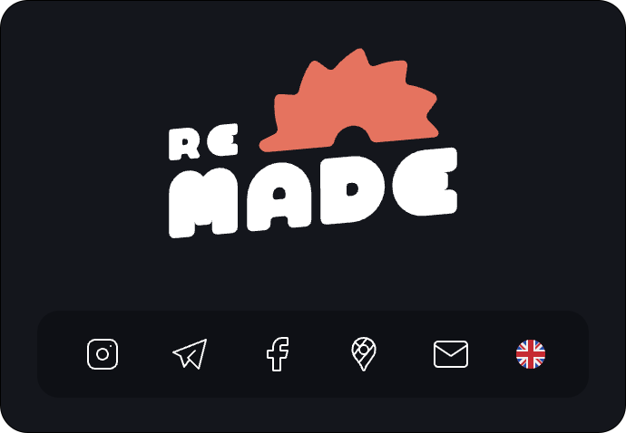

## ReMade website

Static-building, internationalised website for ReMade BCN Maker Space



## Setup

```bash
git clone git@github.com:tancredi/remade-website.git
cd remade-website
npm install
```

## Status

[](https://app.netlify.com/sites/remade-website/deploys)

## Development

Run the development server:

```bash
npm run dev
```

Open [http://localhost:3000](http://localhost:3000) with your browser to see the result.

## Build

Run the static build:

```bash
npm run build
```

The static build should now be available at `./out`. It can be previewed by running:

```bash
npm run server
```

## CMS

The website uses [Decap CMS](https://decapcms.org/) to allow members with push access to edit content through a user friendly UI.

Navitgate to `/admin` to log onto the CMS.

## License

Copyright (c) 2024 Associació Made. - Released under the [MIT license](./LICENSE)
